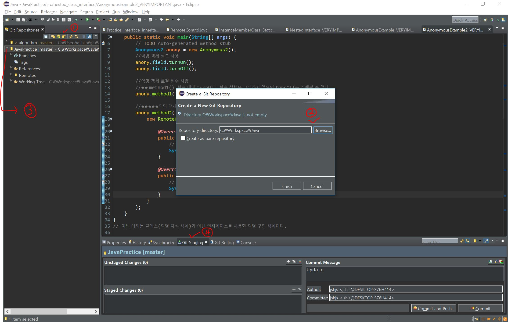

# Java를 연습하는 REPO입니다.

자바를 되짚어보면서 공부하기 위한 공간입니다.

## Eclipse에서 새로운 Repo에 추가연동하는 방법

기존  algorithm  Repository에 이클립스를 연동한 상황에서 새로운 Repository를 이클립스에 추가하여 연동하고 싶은데 따로 설명해둔 곳이 없어서 스스로 알아보고 방법을 여기에 남깁니다.

### (1) Create a new git repository

- 위 사진의 1번을 보면 작은 아이콘이 있다. 이것은 새로운 git repository를 만들어서 추가하는 것이다. 이것으로 새로운 깃을 추가할 수 있다.
- 만약에 왼쪽 사이드바가 보이지 않는다면 Windows - Show View - Other - Git - Git Repositories를  선택하면 된다.
  - 

### (2) Git 추가할 장소 선택하기

- 맨 위 사진의 2번이 나타나면 browse를 통해 git을 생성하고 싶은 장소를 선택한다.
  - 

### (3) 추가된 Repo를 확인하고 add & commit 하기

- 사진의 3에 새로운 Repo가 추가된 것을 확인하면 4번 공간에서 Unstaged Changes를 commit하고 push한다.

### (4) git 연동하기

- 
- 위와 같이 Pull Branch Master가 뜰 것이다. 자신의 github에 새로 만든 repository 주소를 넣고 User와 Password를 입력한 후 연동시키면 끝난다.
- 만약에 뜨지 않는다면 왼쪽 사이드 바에 새로 생긴 Repository에 오른쪽 클릭한 후 Push를 선택하면 된다.